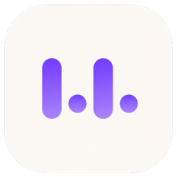

  

<h1 align="center">kiki</h1>

  Dictado por voz con IA, <strong>100% local</strong>, para macOS. 
  Habla y el texto aparece donde esté tu cursor, en cualquier app. Tu voz <strong>nunca sale de tu Mac</strong>.

  <a href="https://github.com/dev2619/kiki/releases/latest"><strong>⬇️ Descargar la última versión</strong></a>
  &nbsp;·&nbsp;
  <a href="https://github.com/dev2619/kiki/releases">Todas las versiones</a>
  &nbsp;·&nbsp;
  <a href="docs/DOCUMENTACION.md">Documentación técnica</a>

---

## ⬇️ Descargar

**[kiki 0.9.1 — descargar el `.dmg`](https://github.com/dev2619/kiki/releases/download/v0.9.1/kiki-0.9.1.dmg)** · [ver el release](https://github.com/dev2619/kiki/releases/tag/v0.9.1)

> El enlace [releases/latest](https://github.com/dev2619/kiki/releases/latest) siempre apunta a la versión más reciente.

**Requisitos:** macOS 14+ · Apple Silicon (M1 o superior) · ~3 GB de disco libre.

## 🚀 Instalación

1. Descarga el `.dmg`, ábrelo y arrastra **kiki** a la carpeta **Aplicaciones**.
2. **Primer arranque:** clic derecho sobre `kiki.app` → **Abrir** → confirma. (Solo la primera vez: el `.dmg` no está notarizado, así que un doble clic normal lo bloquearía.)
3. kiki descarga los modelos de IA la primera vez (con barra de progreso: Whisper ~1 GB + Qwen ~1.6 GB). Necesita internet **solo esa vez**; después funciona 100% offline.
4. Concede permisos de **Micrófono** y **Accesibilidad** cuando los pida. Tras conceder Accesibilidad, **reinicia kiki** una vez.

## ✨ Qué hace

| Función | Cómo se usa |
|---|---|
| **Dictado por tecla** | Mantén **Fn**, habla, suelta → el texto aparece donde esté tu cursor |
| **Manos libres** | Di *"escúchame kiki"* / *"listen to me kiki"* y dicta de corrido; o **⌥⌘K** para dictar al instante |
| **Refinado con IA local** | Quita muletillas y arregla la puntuación **sin cambiar tus palabras** (se puede apagar) |
| **Modo traducción** | Habla en un idioma, escribe en el otro (español ⇄ inglés) |
| **Diccionario personal** | Reconoce y escribe tus términos exactos (nombres, jerga técnica) |
| **Snippets de voz** | Di un atajo → inserta una plantilla, al instante |
| **Historial local** | Tus últimos dictados, copiables y borrables — nunca salen del Mac |
| **Confirmación sonora** | Señales de audio: escuchando / capturando / insertado / desactivado |

## 🔒 Privacidad

Todo ocurre en tu Mac. La transcripción (Whisper) y el refinado (un LLM local) corren **on-device**; tu audio se procesa en memoria y se descarta — nunca se graba a disco ni se envía a ningún servidor. Sin cuentas, sin nube, sin costo por uso.

## 📚 Más

- **[Documentación técnica](docs/DOCUMENTACION.md)** — build desde el código, arquitectura, cómo funciona el refinado y el wake word, decisiones de diseño y backlog.
- **Guía de publicación** — [`docs/RELEASE.md`](docs/RELEASE.md)
- **Marca / logos** — [`docs/brand/`](docs/brand/)

## 📄 Licencia

kiki se distribuye bajo la **[Business Source License 1.1](LICENSE)** (BSL 1.1) — código *source-available*:

- ✅ **Uso personal, educativo, de evaluación y no comercial:** libre. Puedes descargar, usar, estudiar, modificar y redistribuir.
- 💼 **Uso comercial:** requiere una licencia comercial del autor (contacto vía [issues del repo](https://github.com/dev2619/kiki/issues)).
- ⏳ **Change Date — 2030-07-08:** en esa fecha (o a los 4 años de publicar cada versión, lo que ocurra primero) el código pasa automáticamente a **Apache 2.0**.

---

kiki — dictado por voz privado para macOS · <a href="https://github.com/dev2619/kiki/releases/latest">Descargar</a>

